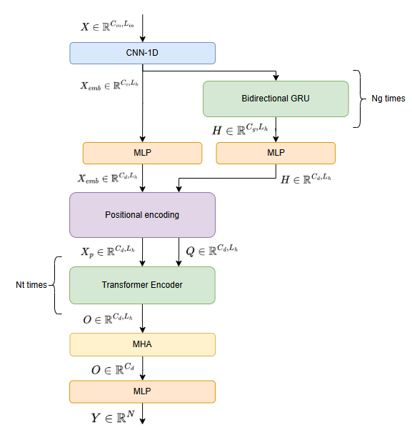
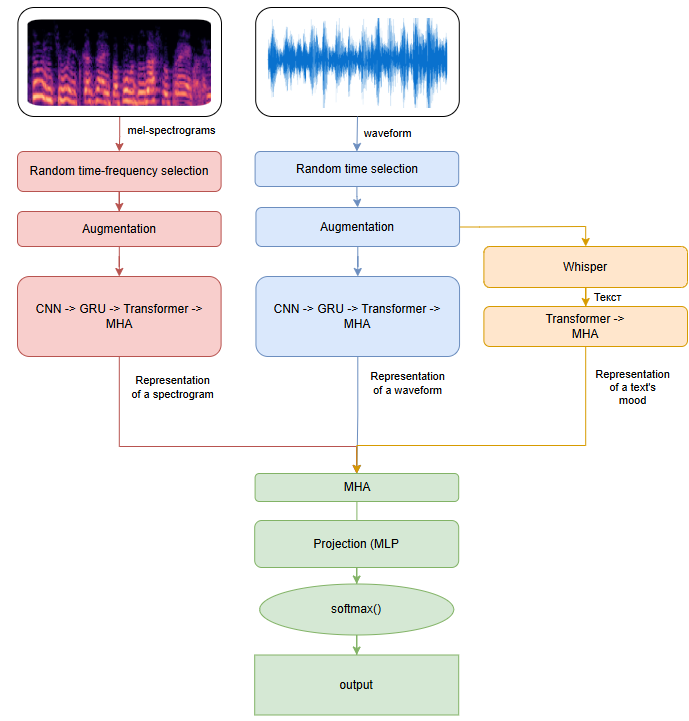

# Music Sentiment Analysis
### Abstract
The development of a system for automatic mood recognition in music using *machine learning techniques* is highly relevant due to several factors.

First, the growing availability of raw audio files in large-scale digital music libraries requires effective tools for organization and retrieval. Manual annotation of mood is time-consuming, subjective, and not feasible at scale. An automated solution enables consistent and efficient labeling of vast music catalogs.

Second, the system is envisioned as a **fully free and open-source solution**, which makes it accessible to researchers, developers, and the broader community. 

Third, the research explores multiple modalities for mood classification:

- Waveform-based approaches, which work directly with raw audio signals and attempt to capture temporal and spectral characteristics without heavy preprocessing.

- Mel-spectrogram-based approaches, which transform audio into a time-frequency representation that is particularly well-suited for deep learning models like CNNs.

- Text-based approaches, which utilize lyrics (where available) to complement audio features, since textual content often carries strong emotional and affective cues.

Finally, In practice, such a system can be applied to in automatic mood annotation for large music catalogs. Streaming services, music archives, and content management platforms could benefit from more intuitive mood-based search, recommendation, and playlist generation, improving user experience and personalization.

### Implementation
##### Instruments
Machine learning and feature extraction:
- CUDA 11.8
- PyTorch 2.7.0
- Torchaudio
- Librosa

Web-application:
- Django
- React
- Nginx

Model API:
- FastAPI

The source dataset is the open [MTG Jamendo dataset](https://github.com/MTG/mtg-jamendo-dataset) with ~14,000 tracks under Creative Commons licenses.

##### Architecture
To reduce the dimensionality of sequence-like input data, the architecture incorporates Convolutional Networks. Transformer and GRU architectures were employed for feature analysis.

To improve predictions, a model for heteroheneous data analysis was developed. This approach improves prediction quality but requires significant computational resources and time investment.

### Results
Classification accuracy exceeding that of a simple audio feature analysis network by 15%, and surpassing a complex pre-trained model by 28%:
- $F_{1_{test}}$ score of 0.74 on the relaxing vs. energetic classification task;
- $F_{1_{test}}$ score of 0.70 on the happy vs. sad classification task.

More results in [report](report.pdf).

The developed model was integrated into a software system for determining the emotional coloring of music based on audio files.

The obtained results and chosen design decisions allow the system to be used both for practical purposes—such as automatic mood annotation of large music collections—and for research purposes, enabling further improvement of models through additional training on other datasets and tasks.
